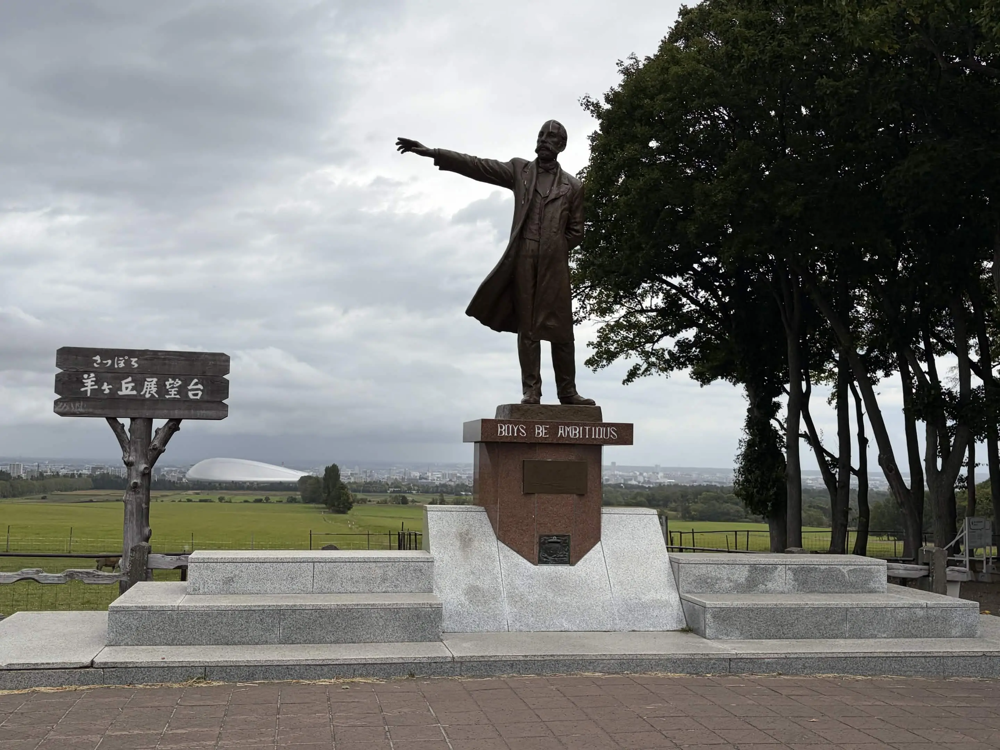
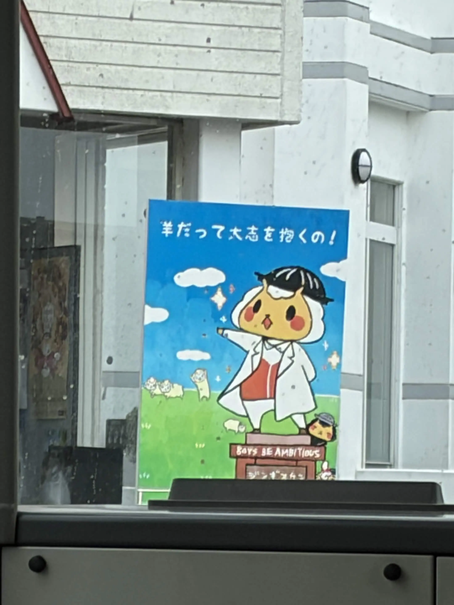
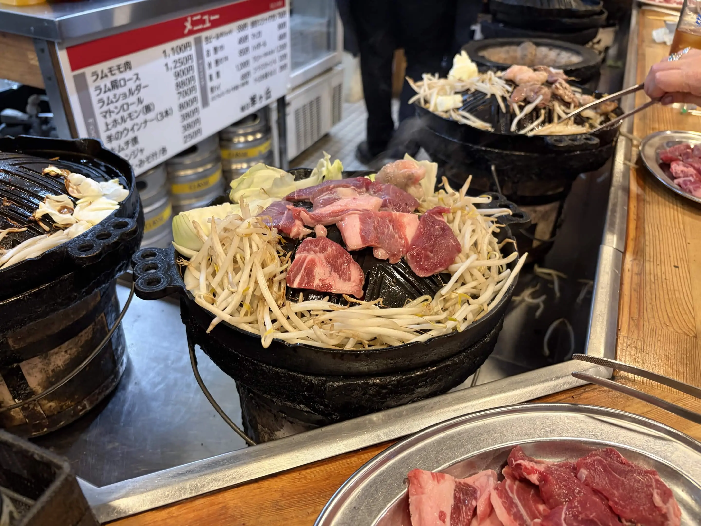
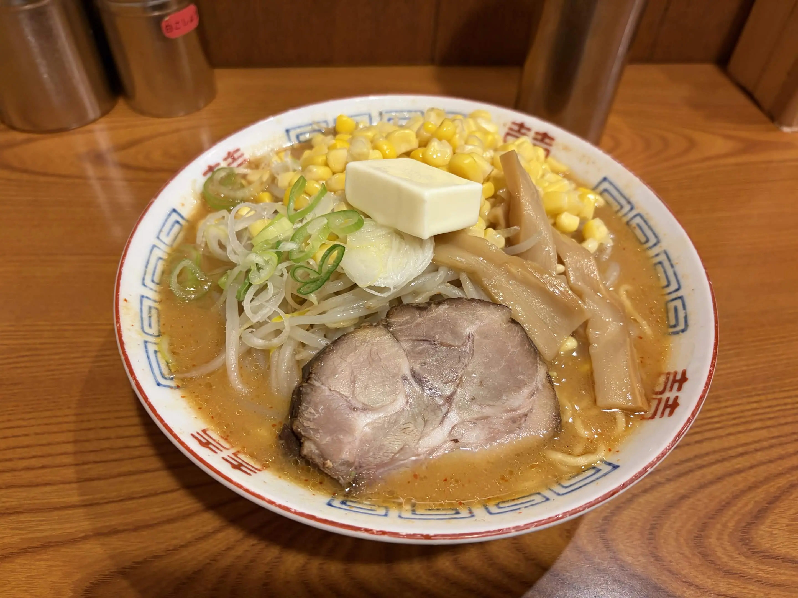

2026 年度の前期(4 月から 9 月)を振り返ります。

## ぱそかた

### ooo

一番大きかったのは自作 Go コンパイラ「ooo」の完成(セルフホスト)です。

https://trap.jp/post/2931

実装を始めたのは 2025 年の 1 月で、4/29 にセルフホストを達成しました。ゴールが近そうな気がしていたので、ゴールデンウィークでまとまった時間を取って終わらせようと思っていたら初日に終わりました。

ooo はセルフホストを目標としていたので、Go のほとんどの機能を実装していません。ソースコードを見てみると、Go らしい機能は全然使ってないと思います。興味がある方は上のブログといっしょに見てみてください。

https://github.com/ikura-hamu/ooo

### traP Collection

引き続き traP のゲーム管理プラットフォーム traP Collection の開発もしています。

7/11 の学生団体交流会というイベントで、traP Collection についての LT をしました。今まで traP Collection についての外部向け資料が無く、これを機に作っておこうと思い登壇しました。

https://speakerdeck.com/ikura_hamu/supporting-a-high-output-game-development-circle-with-a-game-management-platform

また、9/17-21 の東京ゲームショウに traP として出展しており、そこでも traP Collection が使われました。めっちゃでかいイベントで使われて嬉しかったです。動いている様子が見たかったので 21 日に traP の展示スタッフとして行く予定でしたが、台風で中止になってしまいがっかりでした。

### PISCON Portal v2

ISUCON 2026 の開催が発表されたのもあり、PISCON Portal v2 が稼働し始めました。すでに 2 回の PISCON (traP 部内 ISUCON、うち 1 回は初心者向けの講習会つき)を行っています。まだ少しバグがあるので直しながらやっています。近いうちに(PISCON Portal v2 というプロダクトのセマンティックバージョンとしての)v1 をリリースして、ブログも書きたいと思います。

https://github.com/traPtitech/piscon-portal-v2

### Go Conference

プロポーザルの提出、スタッフ、スポンサーの 3 つの要素で関わりました。しかし、直前にインフルエンザになってしまい当日参加できなかったので、準備段階について書きます。

https://gocon.jp/2026

#### スタッフ

去年初めて Go Conference に参加し、楽しかったのでスタッフに応募しました。

準備はスポンサーブースのビンゴラリーを担当しました。特にビンゴ用紙に関する仕事をして、発注先を決めるなどしました。ビンゴ用紙に書いてある「Go Far, BinGo Together」の文言は僕が考えました。企画名として提案して、いいものができたと思います。一方露出はちょっと少なくて残念でした。

この企画タイトルのすごいポイントは来年以降も同じフォーマットでタイトルを作れる点です。Go Conference のテーマは「go」が含まれることが多いです。このタイトルは今回の Go Conference のテーマをもじったものなため、来年以降もカンファレンスのテーマが決まれば自動的にビンゴラリー企画のタイトルが決まります。嬉しいですね。

#### プロポーザル

ooo に関するプロポーザルを書いて採択されました。プロポーザルを公開しています。

https://ikura-hamu.work/blog/260924_go-conference-26-proposal/

プロポーザルを書くのは初めてでしたが、それなりに伝わるものが書けたかなと思います。初めは自分で書いて、それを ChatGPT にレビューしてもらって手直しするのを繰り返しました。Reject されそうな理由を挙げてと言ったら 22 個挙げられて心が折れそうになりましたが、よく読むと妥当でない指摘が多く、LLM もまだまだだな、と思いました。

プロポーザルを書く際には、ただの作ったものの紹介にならないよう気をつけました。なぜなら、そのような発表はあまり面白くなさそうであるため、また、作ったものが何かの役に立つものではないためです。作ることで得られる学びなどを共有して、Go コンパイラ自作に取り組む人を増やすという観点を重視しました。

プロポーザルでどこまで詳細に書くべきかは悩みました。当日話そうと思っていた内容は全て決まっていたので、それを全て書こうとも思いました。一方で、採択されてプログラムにプロポーザルが記載されるような場合には、セッションのネタバレになってしまうのでちょっとぼかした方がいいかもとも思いました。最終的には少し詳細度を落として書きましたが、採択後にはプログラムに書かれる内容を編集することができました。来年以降どうなるか分かりませんが、プロポーザルを出す人の参考になるといいなと思います。

#### スポンサー

traP で Go Conference 2026 のブロンズスポンサーをやりました。

https://trap.jp/post/2944/

最初は僕が traQ の times で「traPがスポンサーになったらめっちゃ面白いが、流石に無いか」と呟いたところから始まりました。希望を部内で調査してみると、意外と乗ってくれる人が多く、お金を集められそうだったので出してみることにしました。どう考えても会社を想定した仕組みなので、法人ではない traP が通るか不安でしたが、無事スポンサーできました。

今回スポンサーをした理由はいくつかあります。まずは上のブログにあるように

- これまでの Go 及びそのコミュニティによって得られた恩恵を還元するため
- これからの Go コミュニティのさらなる発展のため

ですが、部内では「サークルがスポンサーしたら面白くて注目が集まり、今後の traP の活動にプラスの影響がありそう」というのもありました。当日に僕がセッションで traP に言及する計画もありましたが、それは実現せず、実際の影響はそれほどでも無かったかなと思います。

そして、誰にも言ってないもう一つの理由として「traP の人に Go Conference へ参加させる」というものがありました。去年 Go Conference に初めて参加した際、いいイベントだと思う一方で、traP の人があまり参加していないことが残念でした。特に下の方の学年は誰も参加していなかったように思います。これはもったいないと思い、traP の人に Go Conference に参加してもらうにはどうしたらいいか考えました。traP でスポンサーをすれば Go Conference を自分ごととして捉えて参加してくれるのではないかと思い、スポンサーを提案しました。結果として、多くの部員が参加してくれたようでよかったです。参加記を書いている人もいるので、ぜひ読んでみてください。

https://www.luke256.dev/blogs/go-conference-2026

https://trap.jp/post/3036/

https://mumumu6.net/blog/gocon-2026/

### ブログエディタ

このブログのためのブラウザで動くエディタを作りました。スマホでも記事を書きたいと思ったので、ブラウザで動いて PWA にできるものを作りました。この記事もこのエディタで書いていますが、快適に書けています。

https://github.com/ikura-hamu/portfolio2

このサイトそのものは Astro で作っていますが、エディタはインタラクティブな要素が多く、Astro だと辛かったので、エディタ部分は Vue で作って埋め込んでいます。MD を編集すると自動で IndexedDB に保存され、ボタンを押すと GitHub にブランチを作って原稿が保存されます。基本的にはローカルだけでも動作するので、オフラインでも快適に執筆できます。

作るにあたっては以下の記事を参考にしました。

https://www.abap34.com/posts/cms.html

### アルバイト(ピクシブ)

引き続きピクシブでアルバイトをしています。PHP と Next.js を書いています。最近は前者の比重が大きめ。

### サイバーセキュリティ攻撃防御第二

物騒な名前ですが、夏休みの集中講義の講義名です。三浦半島のホテルに 2 泊 3 日で泊まり、楽天の方が講師となってサイバーセキュリティの講義と演習をします。CTF みたいな感じです。ホテルに泊まれてぱそかたできて単位がもらえる最高の授業です。興味ある人はぜひ来年以降受けてみてください。

## ぱそかた以外

### 大学院

東京科学大学大学院工学院情報通信系に進学しました。今までと同じ研究室にいます。

### スマホ買い替え

スマホが iPhone 17 になりました。写真が若干きれいになった気がする。差し込み口が Type-C になったのが大きいです。

### 帰省

夏休みに帰省しました。2 週間くらい帰りました。帰省すると親が色々やってくれるし、素晴らしい食事が提供されるため体調が良くなります(普段悪いわけではない)。ありがとう。

最近の夏休みは、帰ると親戚からもらった桃がたくさん食べられるので嬉しい。

例年通りサッカーを観に行きました。J リーグは今年から夏開幕になったのでホーム開幕戦を観に行きました。勝ってよかった。

### traP 合宿

今年の traP 夏合宿は山中湖でした。ロープウェイで展望台に登ったりボドゲしたりして楽しかったです。が、ここでインフルになってしまいました。大事な予定がある場合はその直前にリスクのある予定を入れない方がいいことを学びました。

### ソサイエティ大会

電子情報通信学会のソサイエティ大会で北海道大学に行って発表してきました。

https://www.ieice.org/jpn_r/activities/taikai/society/2026/

発表はちゃんと伝わったのかどうか微妙で、質問もあまり本質部分ではなくて不安になりました。喋るの下手な気がするので経験を積みたいです。

有名なクラーク博士像を見に行きました。てっきり北大にあるのかと思って、学内のクラーク像を見に行ったら胸像しかなく、そこで調べて羊ヶ丘展望台にあることを知りました。羊ヶ丘展望台は羊を放牧していて、羊がずーーっと草を食べていて面白かったです。この記事のサムネイルはその羊たちです。

食べ物は味噌バターコーンラーメンとスープカレーとジンギスカンを食べました。美味しかった。ジンギスカンは北大にいる高校の同期と食べに行って、会話がすごい盛り上がりました。

## おわり

思い出しながら書いたけど、夏休みより前のぱそかた以外の要素が全然思いつかない。何してたんでしょうか。

後期はぱそかたと研究に加えて就活がんばりたいです。
